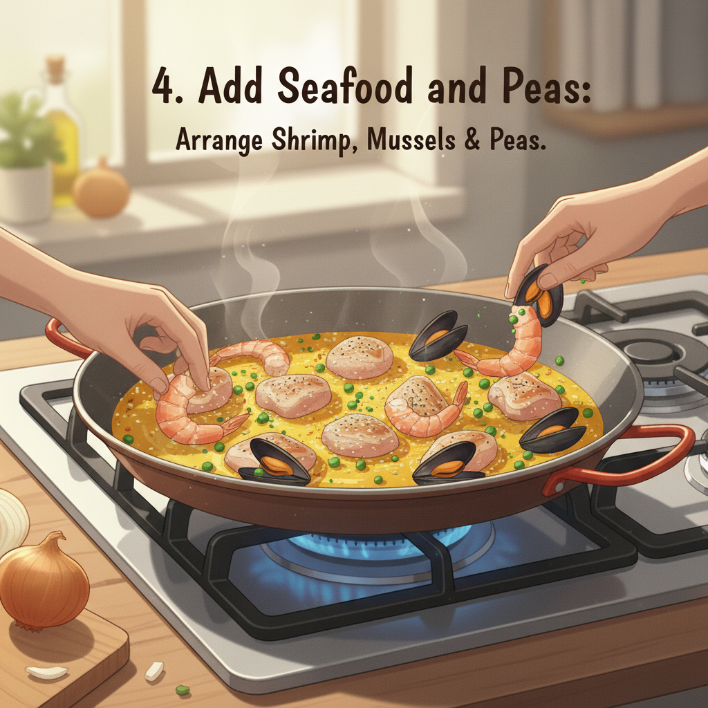
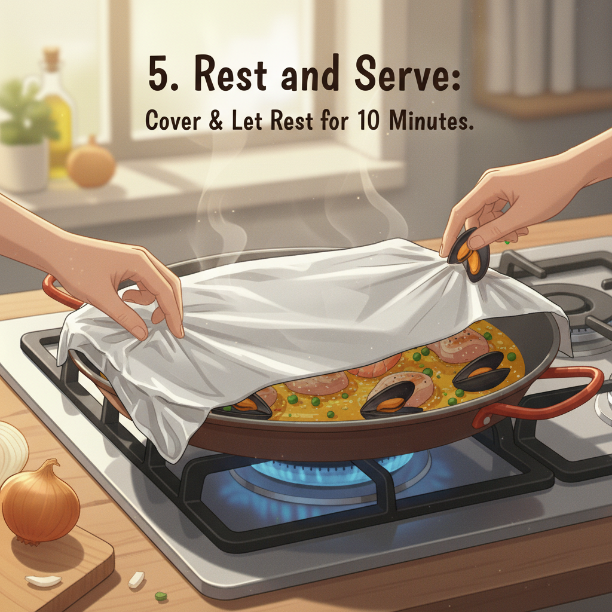
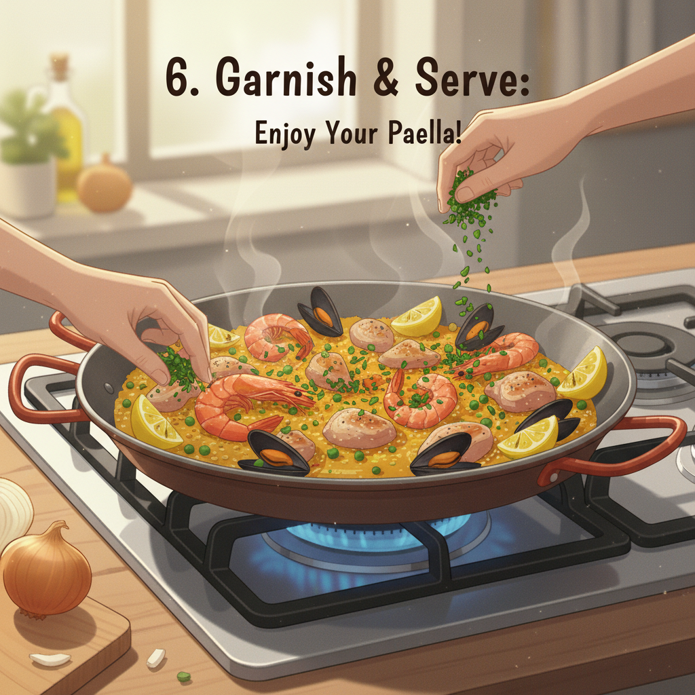

Let's get cooking! Here's an illustrated recipe for a delicious paella:

## Authentic Spanish Paella Recipe

Paella is a classic Spanish dish, famous for its vibrant flavors and beautiful presentation. While there are many variations, this recipe will guide you through making a traditional chicken and seafood paella.

**Yields:** 4-6 servings
**Prep time:** 30 minutes
**Cook time:** 40-50 minutes

---

### Ingredients:

**For the Sofrito (Base):**
*   1/4 cup olive oil
*   1 large onion, finely chopped
*   3 cloves garlic, minced
*   1 red bell pepper, diced
*   1 green bell pepper, diced
*   1 (14.5 ounce) can diced tomatoes, undrained
*   1 teaspoon smoked paprika
*   1/2 teaspoon saffron threads, crushed and steeped in 1/4 cup hot water

**For the Paella:**
*   1 pound boneless, skinless chicken thighs, cut into 1-inch pieces
*   1/2 pound shrimp, peeled and deveined
*   1/2 pound mussels, scrubbed and de-bearded
*   1 1/2 cups paella rice (Bomba or Calasparra)
*   4-5 cups chicken or seafood broth, warmed
*   1/2 cup frozen peas
*   Lemon wedges, for serving
*   Fresh parsley, chopped, for garnish
*   Salt and freshly ground black pepper to taste

---

### Equipment:
*   A large paella pan (15-18 inches) or a wide, shallow pan

---

### Instructions:

**1. Prepare the Sofrito:**

Heat the olive oil in your paella pan over medium heat. Add the chopped onion and cook until softened, about 5-7 minutes. Then add the minced garlic and bell peppers, cooking for another 5 minutes until slightly tender. stir in the diced tomatoes, smoked paprika, and the saffron (with its soaking liquid). Simmer for 10-15 minutes, allowing the flavors to meld and the liquid to reduce slightly. This is your flavorful sofrito! **2. Brown the Chicken:**

Push the sofrito to one side of the pan. Add the chicken pieces to the cleared space and cook until lightly browned on all sides. Season with salt and pepper. **3. Add Rice and Broth:**

Stir the chicken into the sofrito. Add the paella rice to the pan, stirring to coat the grains with the flavorful sauce. Cook for 1-2 minutes. Pour in the warm chicken or seafood broth. Stir gently to distribute the rice evenly. Do not stir again once the rice is simmering, as this prevents the formation of the coveted *socarrat* (crispy rice crust at the bottom). Bring the liquid to a simmer, then reduce the heat to medium-low and cook uncovered for about 15 minutes.

**4. Add Seafood and Peas:**

After 15 minutes, arrange the shrimp and mussels on top of the rice. Sprinkle in the frozen peas. Continue cooking for another 10-15 minutes, or until the rice has absorbed most of the liquid, the shrimp are pink and cooked through, and the mussels have opened. Discard any mussels that do not open.

**5. Rest and Serve:**

Once the liquid is absorbed and the rice is tender, remove the paella from the heat. Cover the pan loosely with foil or a clean kitchen towel and let it rest for 5-10 minutes. This allows the flavors to meld and the rice to finish cooking. Garnish with fresh chopped parsley and serve immediately with lemon wedges. Enjoy your homemade paella! 