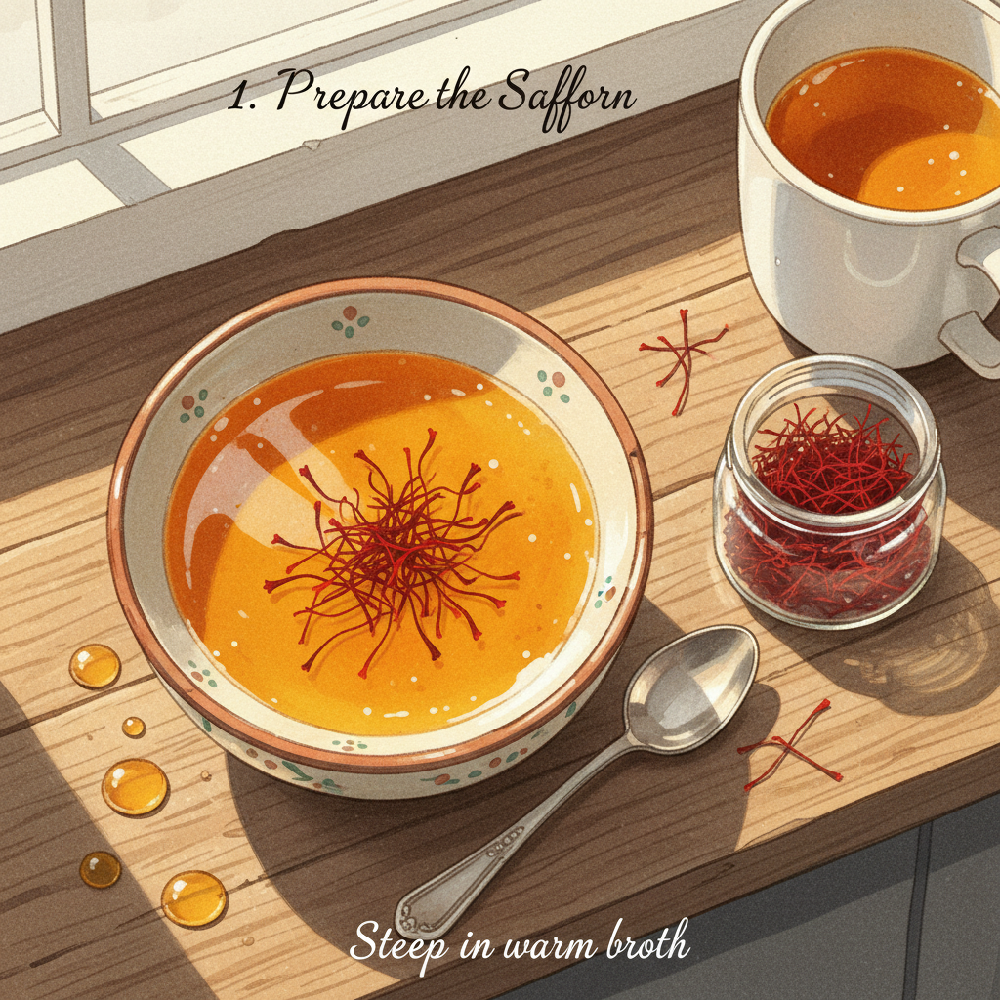
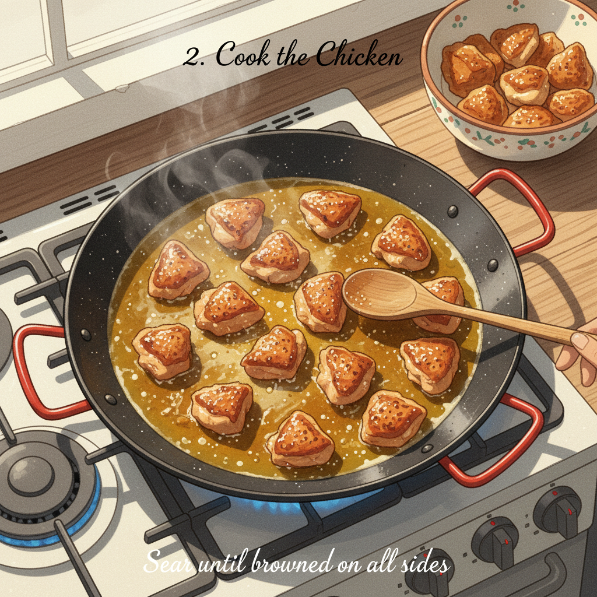
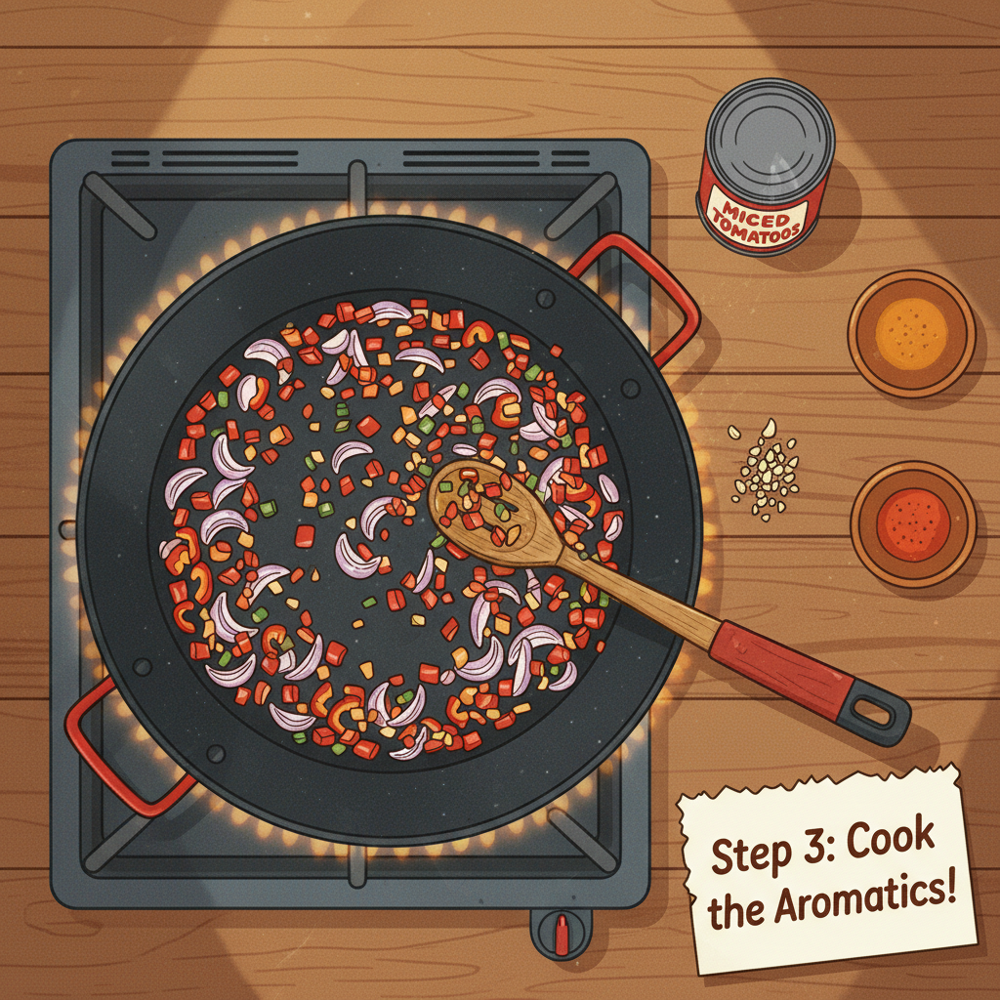

Let's get cooking! Here's an illustrated recipe for a delicious seafood paella.

**Seafood Paella Recipe**

**Ingredients:**

*   1 tablespoon olive oil
*   1 large onion, finely chopped
*   2 cloves garlic, minced
*   1 red bell pepper, diced
*   1 green bell pepper, diced
*   1 (14.5 ounce) can diced tomatoes, undrained
*   1 teaspoon smoked paprika
*   1/2 teaspoon saffron threads (soaked in 1/4 cup warm water)
*   2 cups paella rice (Bomba or Calasparra preferred)
*   4 cups chicken or seafood broth, warmed
*   1 pound mixed seafood (shrimp, mussels, calamari, scallops)
*   1/2 cup frozen peas
*   Lemon wedges, for serving
*   Fresh parsley, chopped, for garnish
*   Salt and freshly ground black pepper to taste

**Instructions:**

**Step 1: Sauté the Aromatics**

Heat the olive oil in a large paella pan or a wide, shallow pan over medium heat. Add the chopped onion and cook until softened, about 5-7 minutes. Then, add the minced garlic and diced bell peppers. Sauté for another 5 minutes until the peppers are slightly tender. **Step 2: Add Tomatoes and Spices**

Stir in the diced tomatoes (undrained), smoked paprika, and the saffron threads (along with the water they soaked in). Cook for about 5-7 minutes, stirring occasionally, until the liquid from the tomatoes has reduced and the mixture thickens slightly. **Step 3: Incorporate the Rice**

Add the paella rice to the pan and stir gently to coat the grains with the tomato mixture. Cook for 2-3 minutes, stirring constantly, allowing the rice to toast slightly. 