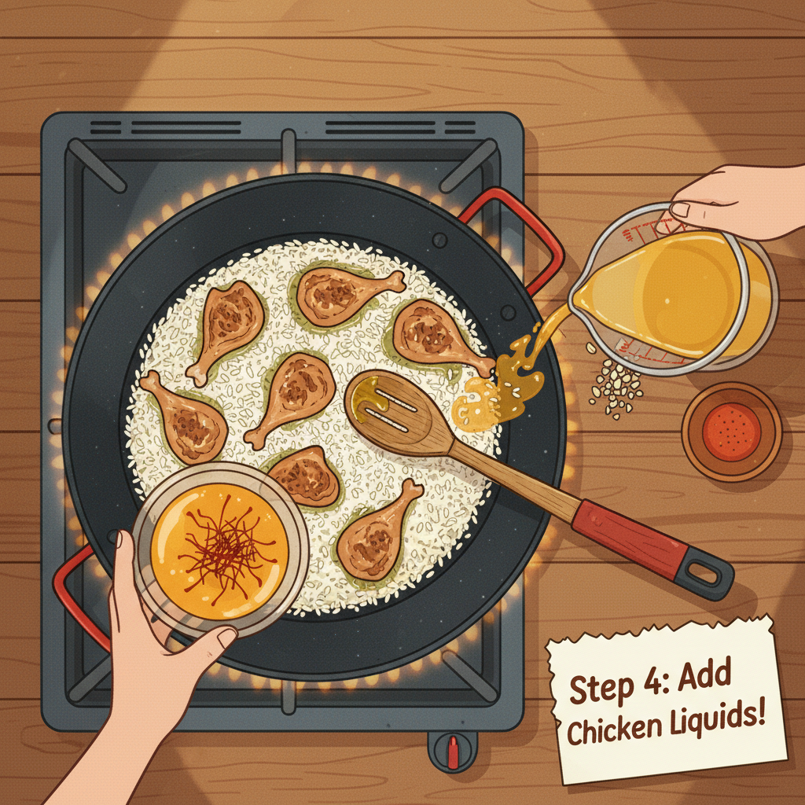
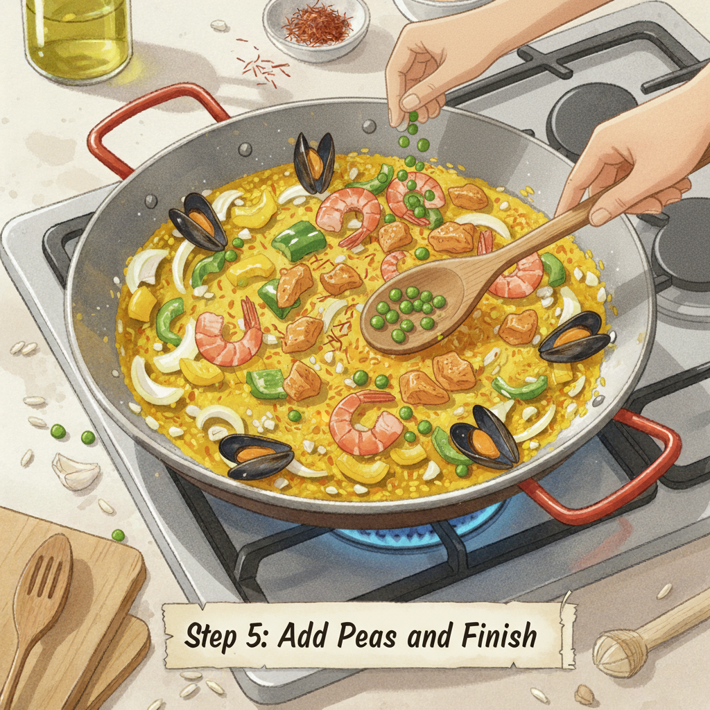
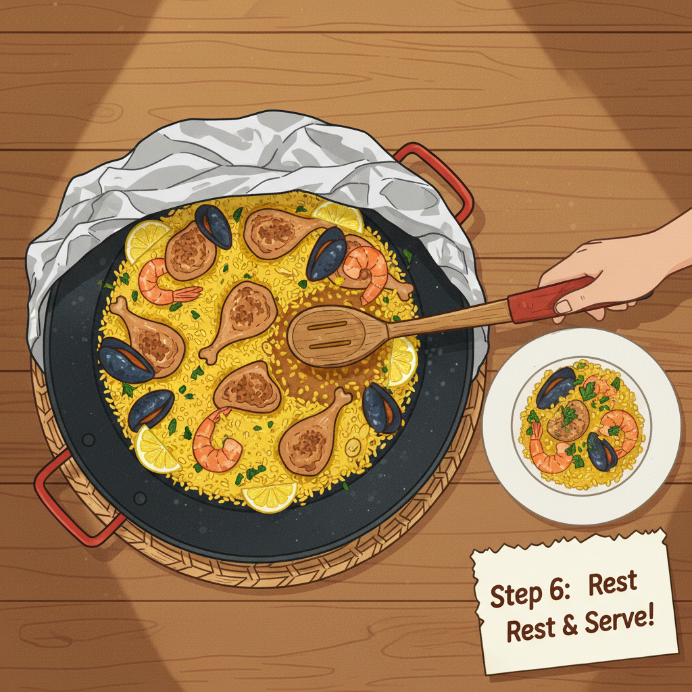

Here's an illustrated recipe for a delicious paella! Let's get cooking.

**Traditional Spanish Paella Recipe**

Paella is a classic Spanish dish, originating from Valencia, known for its vibrant flavors and aromatic spices. While there are many variations, this recipe will guide you through a traditional approach.

**Yields:** 4-6 servings
**Prep time:** 30 minutes
**Cook time:** 45-50 minutes

**Ingredients:**

*   1 pound (450g) boneless, skinless chicken thighs, cut into 1-inch pieces
*   1/2 pound (225g) large shrimp, peeled and deveined
*   1/2 pound (225g) mussels, scrubbed and de-bearded (optional)
*   1/2 cup (120ml) olive oil
*   1 large onion, finely chopped
*   2 cloves garlic, minced
*   1 red bell pepper, diced
*   1 (14.5-ounce/410g) can diced tomatoes, undrained
*   1 teaspoon smoked paprika
*   1/2 teaspoon saffron threads, crumbled and steeped in 1/4 cup hot water
*   4 cups (950ml) chicken broth, warmed
*   2 cups (400g) medium-grain rice (Bomba or Calasparra preferred)
*   1 cup (150g) frozen peas
*   Salt and freshly ground black pepper to taste
*   Lemon wedges, for serving
*   Fresh parsley, chopped, for garnish

---

**Step 1: Prepare Your Ingredients**

Chop your chicken, bell pepper, and onion. Mince the garlic. Have your shrimp and mussels ready. Steep the saffron threads in hot water; this will help release their color and flavor. It's helpful to have everything prepped before you start cooking, as paella moves quickly once it begins.

**Step 2: Sauté the Chicken**

Heat the olive oil in a large paella pan or a wide, shallow pan over medium-high heat. Add the chicken pieces and season with salt and pepper. Cook, stirring occasionally, until the chicken is browned on all sides. Remove the chicken from the pan and set aside, leaving the oil in the pan.

**Step 3: Cook the Aromatics**

Add the chopped onion and bell pepper to the pan. Cook until softened, about 5-7 minutes. Stir in the minced garlic and cook for another minute until fragrant. Then, add the diced tomatoes and smoked paprika. Cook for 5 minutes, stirring occasionally, allowing the flavors to meld.

**Step 4: Add Rice and Liquids**

Return the chicken to the pan. Add the rice and stir to coat it evenly with the vegetable mixture. Pour in the warm chicken broth and the saffron threads steeped in water. Stir gently once to distribute the ingredients. Do not stir the rice extensively after this point; we want to encourage the formation of *socarrat* (the crispy rice crust at the bottom).

**Step 5: Simmer and Add Seafood**

Bring the mixture to a boil, then reduce the heat to medium-low. Let it simmer, uncovered, for about 15 minutes. The liquid should be absorbed, and the rice should be partially cooked. Gently arrange the shrimp and mussels (if using) on top of the rice, nestling them slightly into the surface. Add the frozen peas. Continue to simmer for another 10-15 minutes, or until the shrimp are pink and cooked through, the mussels have opened, and most of the liquid has been absorbed by the rice. Discard any mussels that do not open.

**Step 6: Rest and Serve**

Once the paella is cooked, remove it from the heat. Cover the pan loosely with foil or a clean kitchen towel and let it rest for 5-10 minutes. This allows the rice to finish cooking and the flavors to meld. Garnish with fresh chopped parsley and serve with lemon wedges. Enjoy your homemade paella!

