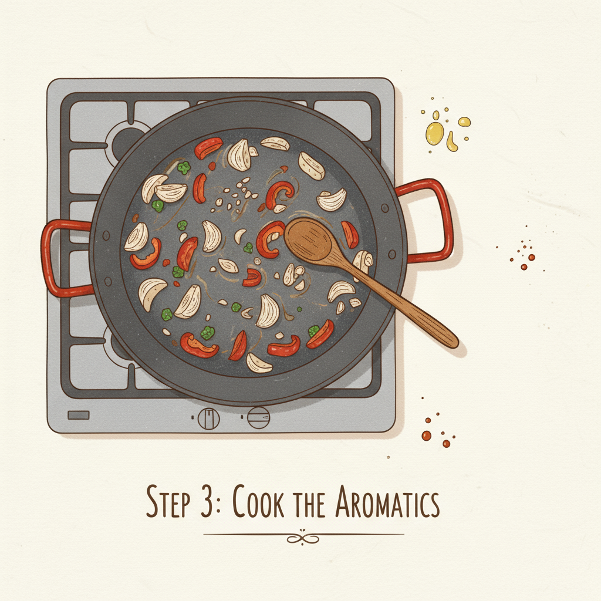

Let's get cooking! Here's an illustrated recipe for a delicious paella:

## Traditional Spanish Paella

Paella is a classic Spanish dish, known for its vibrant colors and rich flavors. While there are many variations, this recipe will guide you through making a traditional chicken and seafood paella.

### Ingredients:

*   2 tablespoons olive oil
*   1 lb boneless, skinless chicken thighs, cut into 1-inch pieces
*   1 lb shrimp, peeled and deveined
*   1 cup chopped chorizo (optional)
*   1 large onion, chopped
*   2 cloves garlic, minced
*   1 red bell pepper, chopped
*   1 (14.5 ounce) can diced tomatoes, undrained
*   1 teaspoon smoked paprika
*   1/2 teaspoon saffron threads, crushed and steeped in 1/4 cup warm water
*   2 cups Bomba rice (or other short-grain rice)
*   4 cups chicken broth, warmed
*   1/2 cup frozen peas
*   1/4 cup chopped fresh parsley
*   Lemon wedges, for serving
*   Salt and freshly ground black pepper to taste

### Equipment:

*   Large paella pan (or a large, shallow, oven-safe pan)
*   Wooden spoon

### Instructions:

**Step 1: Prepare Your Ingredients**

Before you start cooking, it's helpful to have all your ingredients prepped and ready to go. Chop your chicken, onion, bell pepper, and mince your garlic. Don't forget to steep your saffron threads!
**Step 2: Sauté the Chicken and Chorizo**

Heat the olive oil in your paella pan over medium-high heat. Add the chicken pieces and cook until browned on all sides. If using, add the chorizo and cook until lightly crisped. Remove the chicken and chorizo from the pan and set aside, leaving any drippings in the pan.

**Step 3: Cook the Aromatics**

Add the chopped onion and bell pepper to the pan and cook until softened, about 5-7 minutes. Stir in the minced garlic and cook for another minute until fragrant.

