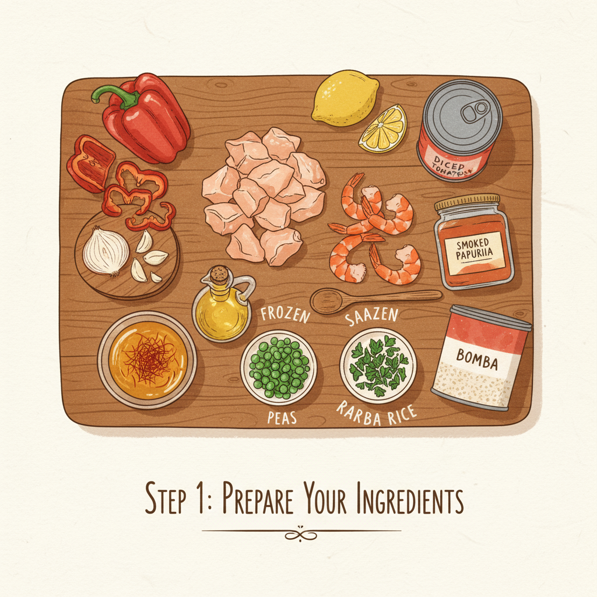

Let's get cooking! Here's an illustrated recipe for a delicious paella:

## Traditional Spanish Paella Recipe

Paella is a classic Spanish dish, famous for its vibrant flavors and communal spirit. While there are many variations, this recipe will guide you through making a wonderful chicken and seafood paella.

---

### Ingredients You'll Need:

*   1.5 lbs boneless, skinless chicken thighs, cut into 1-inch pieces
*   1 lb large shrimp, peeled and deveined
*   1 cup calamari rings (optional)
*   1 cup mussels or clams, scrubbed
*   4 cups short-grain Spanish rice (Bomba or Calasparra)
*   6-8 cups chicken or seafood broth, warmed
*   1/2 cup olive oil
*   1 large onion, finely chopped
*   1 red bell pepper, finely chopped
*   4 cloves garlic, minced
*   1 (14.5 oz) can diced tomatoes, undrained
*   1 teaspoon smoked paprika
*   1/2 teaspoon saffron threads, crumbled and steeped in 1/4 cup warm broth
*   1 cup frozen peas
*   Lemon wedges, for serving
*   Fresh parsley, chopped, for garnish
*   Salt and freshly ground black pepper to taste

---

### Equipment:

*   A 15-inch paella pan (or a large, shallow skillet)

---

### Step 1: Prepare Your Ingredients

Before you start cooking, it's essential to have all your ingredients prepped and ready. Chop your chicken, onion, bell pepper, and mince the garlic. Have your broth warmed and saffron steeped. This makes the cooking process much smoother! 

---

### Step 2: Sauté the Chicken

Heat the olive oil in your paella pan over medium-high heat. Add the chicken pieces and cook until nicely browned on all sides. Remove the chicken from the pan and set it aside, leaving the flavorful drippings in the pan. 